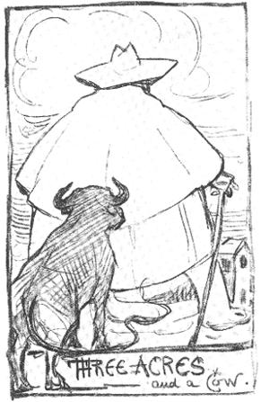

# Universal Title
the basis of isocracy

## Motivation
Let’s make our societies civil again. In proposal, in order to witness this end, we divide the value of the earth equally across all conceived living beings.

## Predistribution as Right
[These figures derived](https://gist.github.com/kuttaineh/8b7830a1a3e0f10467b90cd3049424d4) came from the whole landmass of the earth divided by the three example population sizes. This proposal eliminates homelessness coming out of a lack of an explicit title. Note the right, as expressed, is Predistributionist in form.

Drawing by Chesterton before 1936. For essays in this area, see [The Hound of Distributism](https://www.chesterton.org/store/product/hound-of-distributism/).

With such folk always have a fallback position in any employment negotiation. If an employer is unable to make a sufficient return for labor then a person could  claim their share of the earth in physical form and take up vertical farming. Nothing would prevent the same from keeping both a garden and working jobs if this were their choice. It's left to the individual to determine.

This new universal human right, preexisting to government, becomes the basis for the justification of the defense of government.

This [Social Contract](https://github.com/kuttaineh/unknotted#how-shall-the-social-contract-be-defined) comes out of [The Outline of Sanity](https://archive.org/details/theoutlineofsanity) and Henry George. It's out of the British Analytic tradition and American Revolutionary thinking.

Unencumbered small landholding, more specifically the value thereof, is the right for the purpose of abolishing inquity without without placing limits upon individual acheivement, thus is universal title.

View these short slidedecks to see sample proposals on how to get from here to there: [TRANSITION](https://www.dropbox.com/s/e5saemk5ean6q4l/TRANSITION.pptx?dl=0) & [TRANSITION II: Earthsharing](https://www.dropbox.com/s/x7fguox3i251sku/TRANSITION_II.pptx?dl=0).
